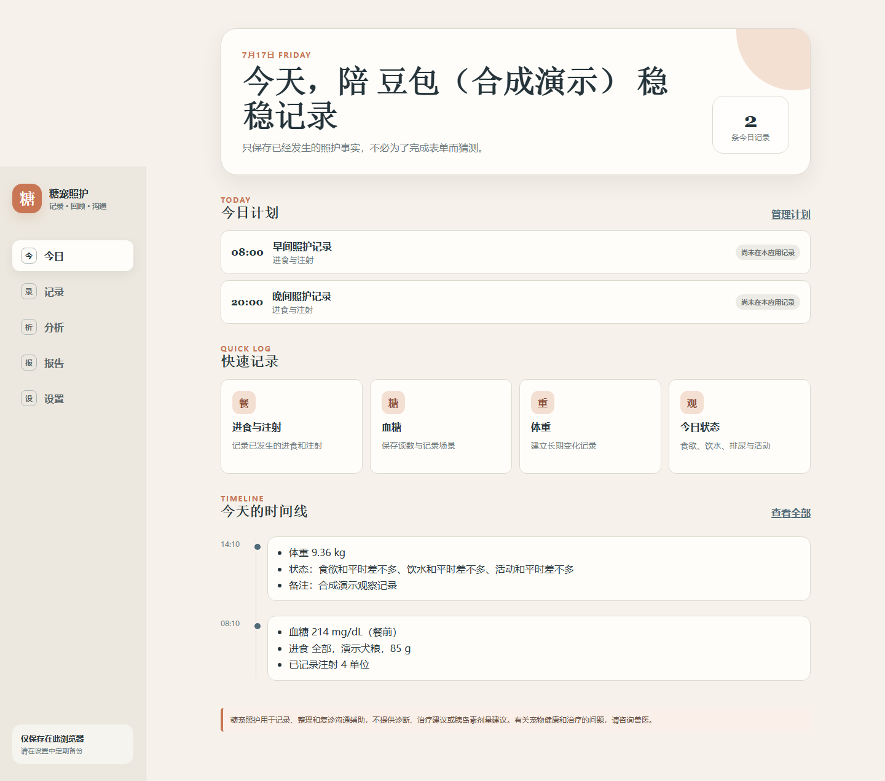

# 糖宠照护 Web MVP

面向第一次长期照护糖尿病小狗的宠物家长，用较少步骤记录已经发生的照护行为和观察事实，并生成便于复诊沟通的材料。

> 糖宠照护用于记录、整理和复诊沟通辅助，不提供诊断、治疗建议或胰岛素剂量建议。有关宠物健康和治疗的问题，请咨询兽医。

当前版本：`0.4.0`。这是作品集可运行 MVP，不是医疗设备，也尚未经过目标用户研究和兽医专业审核。



## 核心闭环

`首次建档 → 查看今日计划 → 快速记录 → 数据质量/描述性分析 → 打印复诊报告`

- 今日：用户自行设置的应用内计划、四类快捷记录和当天时间线。
- 记录：历史筛选、编辑、删除/撤销，以及血糖和体重原始趋势。
- 分析：记录覆盖、类型/时段分布、字段完整性、单位一致性、按单位数值摘要和 CSV 导出。
- 报告：7/14/30 天记录覆盖、事实时间线和用户自行填写的问题。
- 设置：档案、计划、JSON 备份恢复、合成 Demo 和隐私边界。

## 本地运行

```bash
npm install
npm run dev
```

浏览器打开终端显示的地址。首次使用可以建立空白档案，也可以在“设置”中加载明确标注的合成 Demo。

## 验证

```bash
npm run lint
npm run safety
npm test
npm run build
npx playwright install chromium
npm run test:e2e
```

当前本地验证结果：ESLint、TypeScript/Vite 构建、安全文案扫描全部通过；Vitest 14/14，通过 Playwright 在 375px、768px、1440px 三档视口运行 9/9 个流程用例。

## 数据与隐私

- 数据保存在当前浏览器的 `localStorage`，键为 `pet-diabetes-care-log:v0.3`；0.4.0 分析功能只读取并派生结果，不改变存储 schema。
- 无账号、后端、分析 SDK、广告或记录上传。
- 导入必须通过 Zod schema v0.3 全量校验。
- 导入和清空前先下载当前数据备份。
- 修改默认单位不会转换历史记录，每条记录保留自己的原始单位。

## 技术结构

- React + TypeScript + Vite
- React Router（Hash Router，兼容静态托管）
- Zod schema + 版本化存储仓库
- React Context + reducer
- Chart.js + 原始数据表
- Vitest + Testing Library + Playwright
- GitHub Actions + GitHub Pages

更多信息：

- [架构与数据流](docs/architecture.md)
- [记录数据分析设计](docs/data-analysis-design.md)
- [用户旅程与待验证假设](docs/user-research.md)
- [安全审核](docs/safety-review.md)
- [测试报告](docs/test-report.md)
- [发布清单](docs/release-checklist.md)
- [合成示例复诊报告](output/pdf/糖宠照护_合成示例复诊报告.pdf)

## 已知限制

- P0 只展示小狗场景；类型层预留猫，但未提供猫专用流程。
- 网页关闭后不提供系统通知。
- 无跨设备同步、家庭协作、OCR、检测仪连接和 AI 总结。
- 真实用户任务成功率、记录耗时和复诊价值尚待测试，项目不会虚构这些结果。
