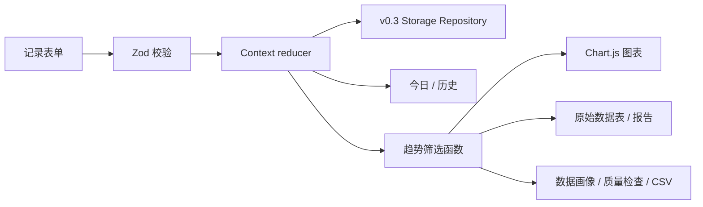

# 架构与数据流

## 模块

```text
src/
  app/          路由、布局、Context + reducer
  domain/       Zod schema、类型和纯函数
  storage/      v0.3 localStorage repository
  features/
    onboarding/
    today/
    records/
    analytics/
    reports/
    settings/
  demo/         合成演示数据
  styles/       移动优先与 A4 Print CSS
```

## 数据流



导入使用以下顺序：

```text
选择文件 → JSON 解析 → schema v0.3 全量校验 → 数量预览
→ 用户确认 → 下载当前备份 → 单个 localStorage key 替换
```

任何解析或校验失败都在替换前结束。

## 关键设计决策

- 使用 Hash Router，使构建产物可直接部署在 GitHub Pages 子路径。
- 报告为派生视图，不保存第二份记录。
- 分析页调用纯函数计算覆盖、分布、完整性和描述性统计，不保存分析副本。
- 不同血糖单位分组计算，不进行静默转换或合并。
- 趋势图与表格调用同一范围筛选结果。
- 胰岛素对象只允许 `administered: true`，并由交互层要求用户再次确认。
- 每条血糖记录保存单位；档案的默认单位只影响新记录。
- P0 使用一个版本化存储键，方便原子替换、完整备份和未来迁移。
