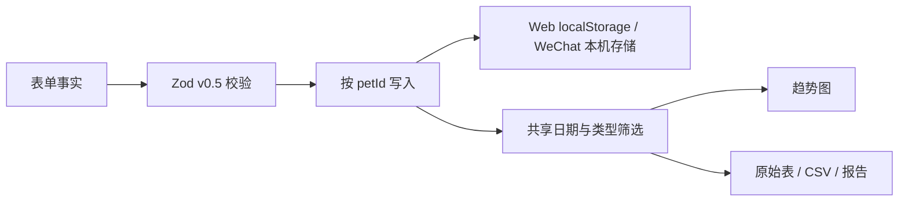
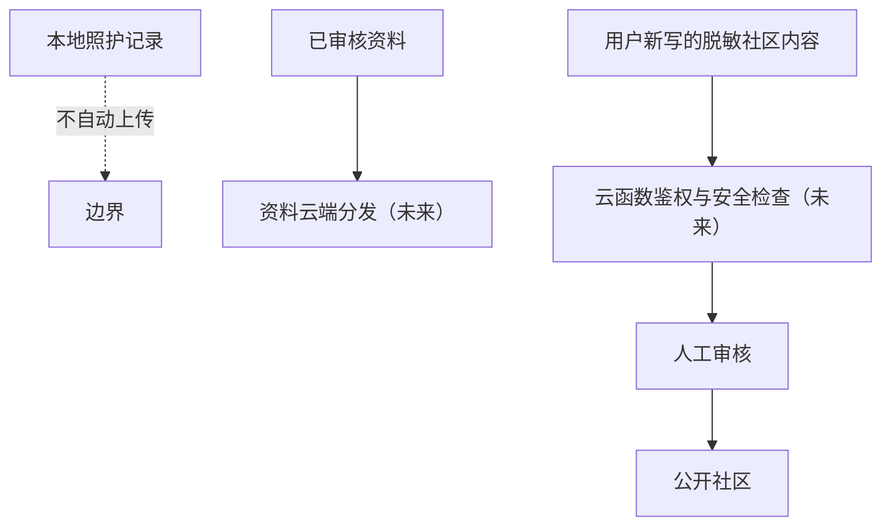

# 架构与数据流

## 工作区

```text
apps/
  weapp/                 Taro 4 + React 18 微信小程序原型
packages/
  domain/                Zod schema、迁移输入类型、筛选与分析纯函数
  content/               CareArticle 契约、来源目录和发布门禁
  platform-adapters/     Browser / WeChat 键值存储适配器
src/
  app/                   Web 路由、Context + reducer
  storage/               v0.5 localStorage repository 与 v0.3 迁移
  features/              今日、记录、分析、报告、资料、社区、设置
  community/             治理 schema、风险标记、权限和本机原型仓库
```

Web 与小程序分别使用 React 19 和 React 18；共享包不依赖 DOM、路由或图表。Vite Web 使用独立缓存目录，避免与 Taro 工作区的 React 运行时混用。

## 照护数据流



导入顺序：`解析 → v0.5 或旧 v0.3 全量校验 → 预览 → 下载当前备份 → 用户确认 → 单键替换`。旧键迁移后保留，任一校验错误都在覆盖前终止。

## 云端边界



当前没有云端实现。社区页面是独立的本机治理原型，不读取宠物姓名、血糖、治疗量、备注或原始时间线。

## 关键决策

- 报告、图表和 CSV 共用 `selectRecords`，不保存分析副本。
- 所有记录、计划、趋势和报告按当前 `petId` 隔离。
- 治疗事件只允许 `administered: true`；名称、治疗量和时间均不自动建议。
- 资料只发布 `reviewed` 且复审日期有效的文章。
- 社区普通成员不能调用审核状态变更；高风险举报立即隐藏并记录审核动作。
- 小程序报告当前仅为页面摘要；Canvas 长图和真机兼容仍待验证。
